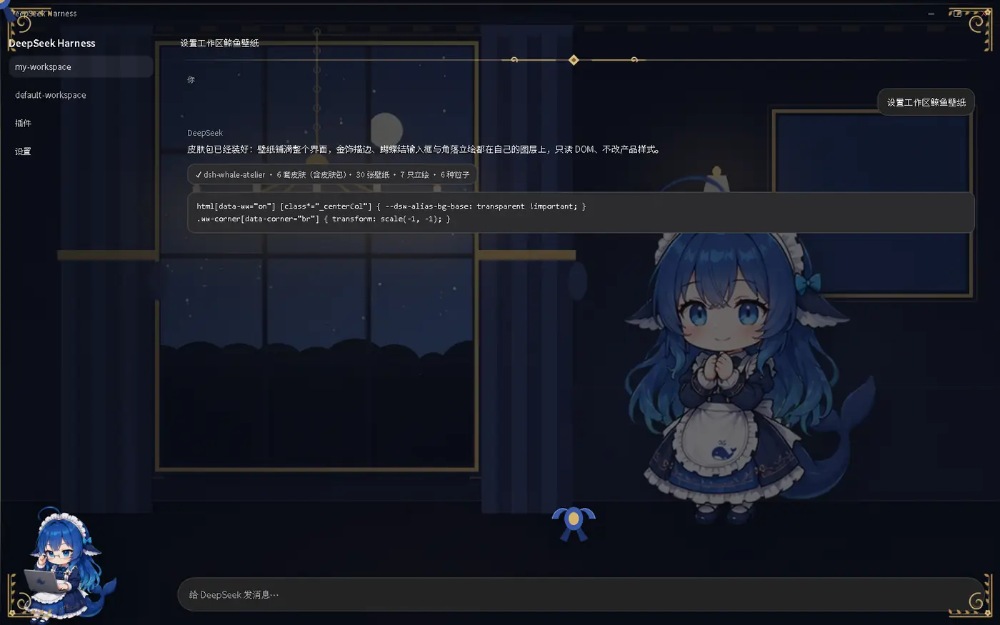
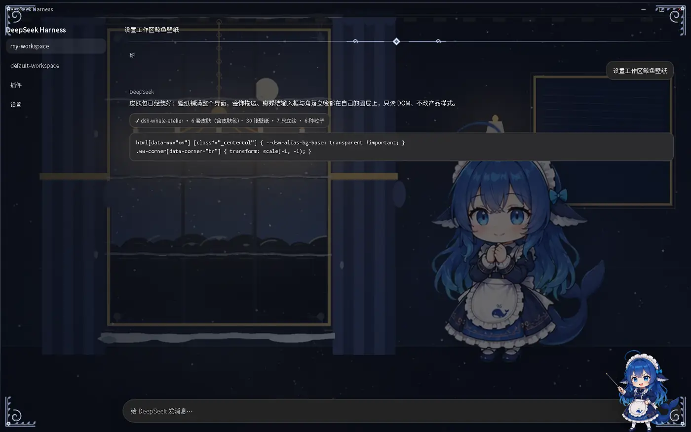
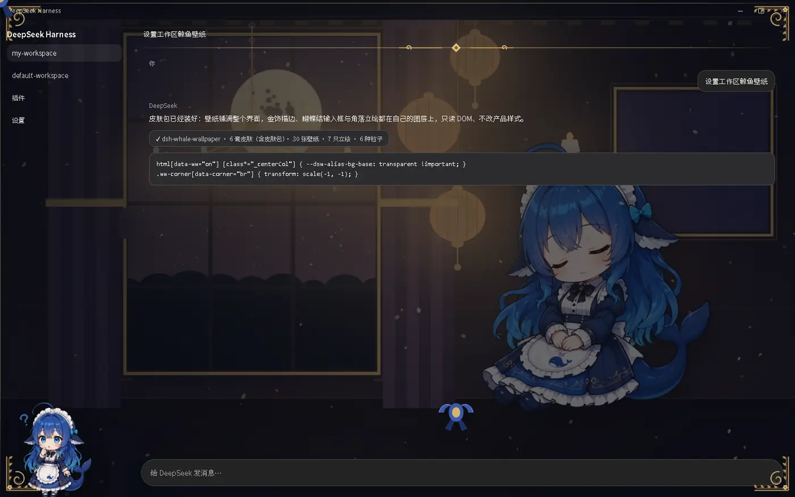
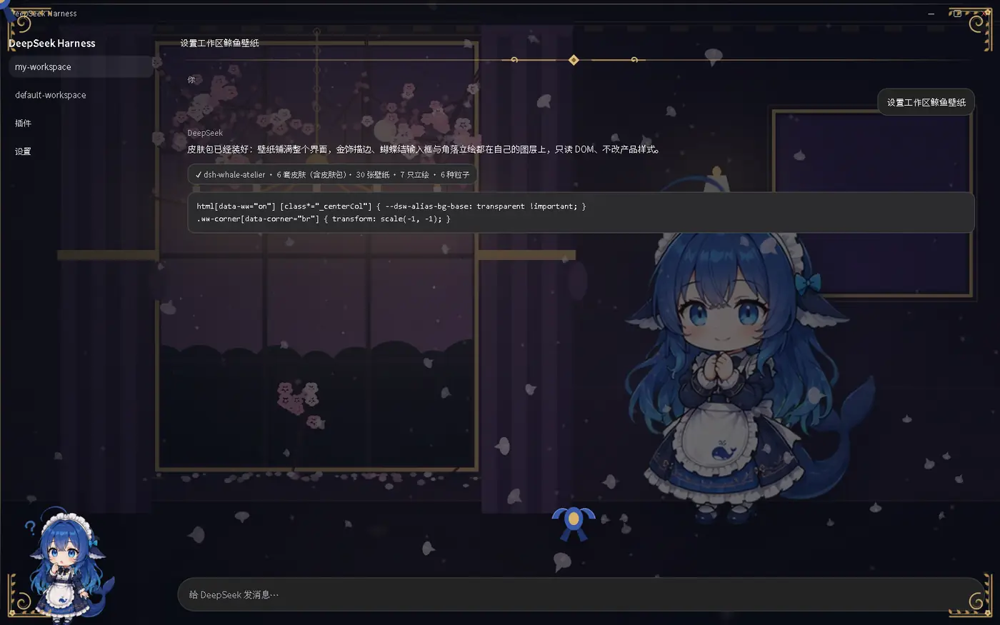
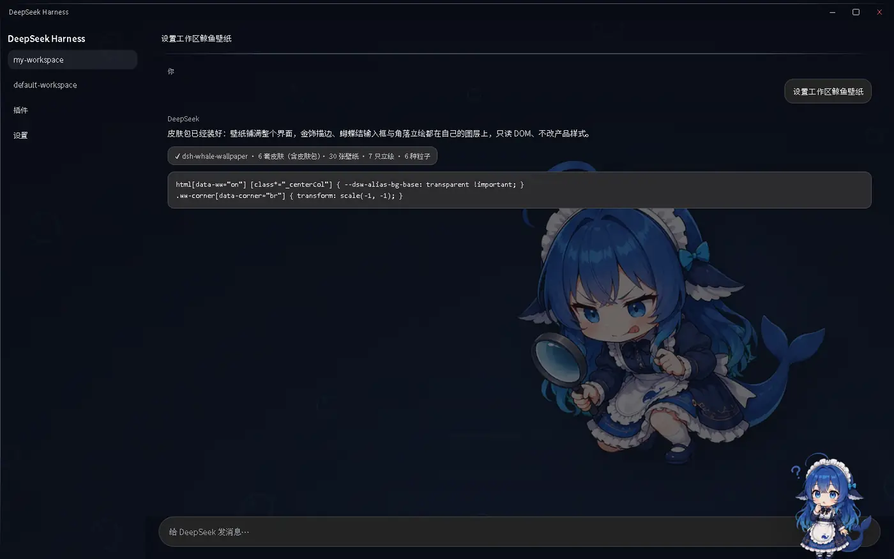
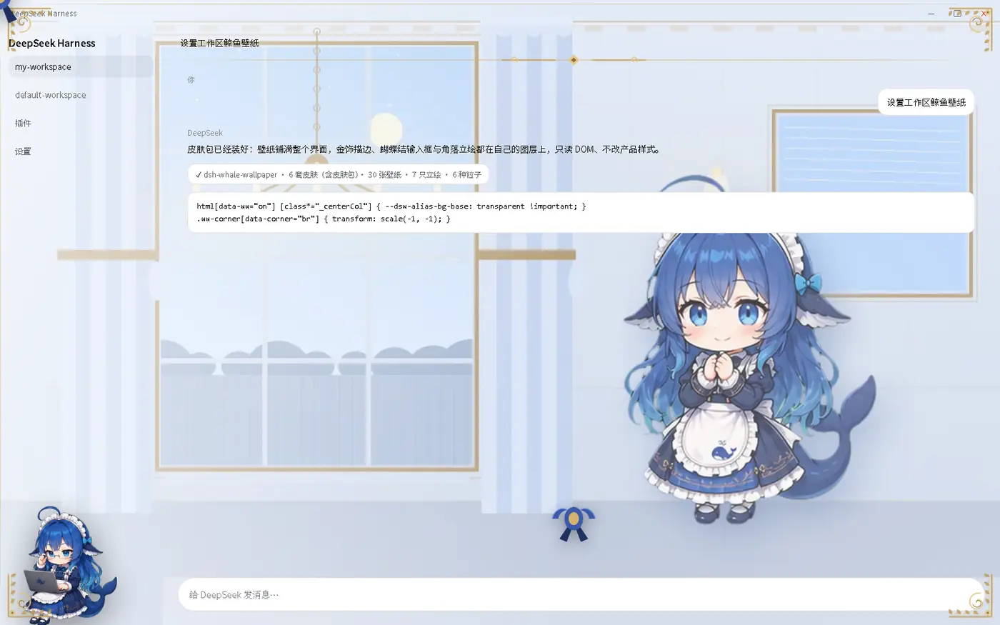

# dsh-whale-wallpaper

为 [DeepSeek Harness](https://github.com/deepseek-ai) 的 Web GUI 做的**鲸鱼皮肤包**：把鲸鱼娘立绘铺成整个界面的壁纸，再叠一层金/银描边装饰、蕾丝、蝴蝶结与角落立绘，并带环境粒子与 Agent 状态联动。

零侵入：不改任何内置包文件，不写产品元素的属性；所有效果都挂在 `html[data-ww="on"]` 下，关掉即回到出厂外观。



<details>
<summary>更多截图</summary>

| | |
|---|---|
|  |  |
|  |  |
|  | |

</details>

## 特性

- **五套内置皮肤**：女仆工坊 / 夜庭银饰 / 深海 / 雪夜庭（季节）/ 桂月夜庭（季节）。每套 = 壁纸场景 + 描边金属 + 蕾丝蝴蝶结 + 角落立绘 + 环境粒子，整套切换、即时生效
- **第三方皮肤包**：一个目录 + 一份 `skin.json` 就是一套皮肤，支持三条安装路径（详见 [docs/SKIN-PACKS.md](docs/SKIN-PACKS.md)）。仓库自带示例包 [`skins/sakura`](skins/sakura)（樱吹雪）
- **覆盖范围**：全界面（侧栏 + 标题栏 + 工作区）/ 仅工作区
- **明暗策略**：跟随 GUI 主题 / 按时段自动切昼夜（07:00–18:30 用白天版）/ 固定深色 / 固定浅色
- **画面三维度**：遮罩浓度、暗角强度、景深模糊
- **环境粒子**：花瓣 / 萤火 / 气泡 / 雪花 / 桂花 / 樱花，随皮肤切换，遵循 `prefers-reduced-motion`
- **角落立绘联动 Agent 状态**：等待审批 / 生成中 / 出错 / 刚完成各换一个形象，呼吸节奏随之变化
- **设置导出 / 导入**：一段自包含 JSON，可复制到别的机器一键套用
- 全部资源由插件自己的只读路由提供，**零外部请求、零遥测**

## 安装

### 1) 作为插件装进某个 profile

```bash
# GitHub 直装（pnpm 支持 git spec）
cd ~/.dsh/profiles/<profile>
"<runtime>/dependencies/node/bin/node.exe" \
  "<runtime>/dependencies/pnpm/bin/pnpm.mjs" add "github:Cicero010/dsh-whale-wallpaper"
# 再把 "dsh-whale-wallpaper" 追加到 package.json 的 dsh.profile.bundles 末尾
```

也可以直接在 GUI 的**插件**页安装该组合包。

### 2) 本地目录链接

```bash
git clone https://github.com/Cicero010/dsh-whale-wallpaper ~/.dsh/plugins/dsh-whale-wallpaper
cd ~/.dsh/profiles/<profile>
"<node>" "<pnpm>" add "link:C:/Users/<you>/.dsh/plugins/dsh-whale-wallpaper"
# 同样把包名加进 dsh.profile.bundles
```

profile 里 `dsh-hmr` 默认启用，所以追加 bundles 后**宿主半边就地挂载**；浏览器半边在刷新页面时重新组合启动图。

### 3) 只想试一下壁纸

把 `lib/` 与 `assets/` 复制进任意已注册的插件目录，或参考 [docs/PLUGIN.md](docs/PLUGIN.md) 里的原理自己接。

## 装示例皮肤包（可选）

```bash
python tools/install_skin_pack.py skins/sakura   # 免重启，刷新页面即生效
```

或者把 `skins/sakura/` 复制到 `$DSH_HOME/whale-wallpaper-skins/`（宿主发现路径，需重启一次宿主）。
仓库自带的 `skins/` 目录也是宿主启动时会扫描的**内置皮肤包**目录。

## 目录结构

```
lib/            宿主半边（三条只读路由：assets / skins / pack）+ 浏览器半边
assets/         内置皮肤素材：wallpaper.css、24 张壁纸、饰件、立绘、缩略图
skins/          随仓库分发的皮肤包（sakura = 樱吹雪）
docs/           皮肤包格式说明、插件原理与限制、截图
tools/          生成与安装工具（见下）
tests/          四个可跑的测试
```

## 工具

| 脚本 | 用途 |
| --- | --- |
| `tools/make_wallpapers.py --set abyss\|interior\|snow\|moonfest\|sakura\|all` | 用 Pillow 合成壁纸底图（`all` = 内置 4 套共 24 张） |
| `tools/make_ornaments.py` | 生成金/银藤蔓角花、蕾丝、蝴蝶结、分隔饰件 |
| `tools/make_thumbs.py [--pack <目录>]` | 生成皮肤选择器缩略图 |
| `tools/install_skin_pack.py <目录> \| --uninstall <id> \| --list` | 皮肤包装进/移出插件索引（免重启） |

壁纸依赖 [`dsh-whale-musume`](https://github.com/Sutera-Diffusus/dsh-whale-musume) 的立绘素材，生成前请先安装它（见 [THIRD-PARTY-NOTICES.md](THIRD-PARTY-NOTICES.md)）。

## 测试

```bash
node tests/run.mjs
```

| 测试 | 覆盖 |
| --- | --- |
| `test_skin_pack.mjs` | `skin.json` 解析与校验：默认值、枚举回落、缺字段、坏 JSON、非法 id、超长截断 |
| `test_pack_routes.mjs` | 三条路由的集成测试（真 http server + 桩 ctx）：清单合并、坏包记录、包内取图、**双根解析**、目录穿越与非法 id 一律 404 |
| `test_normalize_pref.mjs` | 设置导入的白名单与类型校验 |
| `test_state.mjs` | Agent 状态判定（含"生成中 + 旧错误行"、隐藏节点与非误判） |

## 兼容与限制

- 目标运行时：DSH `0.2.0-rc.2`（桌面端内嵌运行时）
- 依赖内置客户端的 CSS-module 类名后缀（`_frame`、`_centerCol`、`_sidebarCol`、`_composerSeat`、`_header`、`_running`、`_turnErrorRow`、`_reject`）与 `--dsw-alias-bg-base`、`--dsw-specific-sidebar-fill` 令牌。DSH 改名后对应效果会**静默失效**（界面回到出厂外观，不报错）
- 装饰层只读外壳几何，不做像素级锁定；布局变化由 `resize` + 1.5s 低频同步兜住
- 皮肤包的**宿主发现**路径（投放目录 / 插件声明 `dsh.whaleWallpaperSkins`）需要重启一次宿主；索引安装路径不需要
- 立绘与壁纸衍生自 `dsh-whale-musume`（MIT），仅本地使用，请遵守其许可

## 许可

[MIT](LICENSE) © Cicero010
第三方素材与代码的许可见 [THIRD-PARTY-NOTICES.md](THIRD-PARTY-NOTICES.md)
